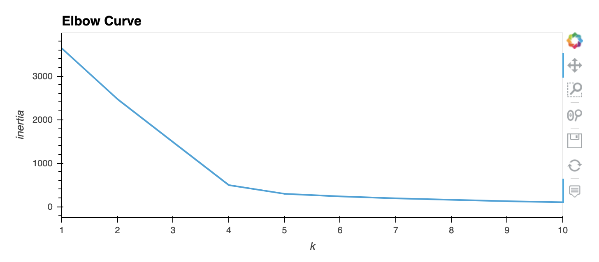

# Cryptocurrencies

Analyis of cryptocurrencies using unsupervised machine learning

## Overview
### Purpose
The purpose of this project is to analyze trends in Cryptocurrency to help an investment bank who is interested in offering a new cryptocurrency investment portfolio for its clients. Because there are many different cryptocurrencies to choose from, the goal is to begin to group various cryptocurrencies together to see what kinds of trends we can uncover.

### Resources
Data 
- [crypto_data.csv](crypto_data.csv)

Technologies used
- Python
- Jupyter Notebook
- scikitlearn, pandas, hvplot libraries

## Results
#### Full code can be found at [crypto_clustering.ipynb](crypto_clustering.ipynb)

### Step 1: Pre-processing the data for analysis.
This step involved reading in the data, dropping records of cryptocurrencies not being traded, dropping rows with null values, dropping rows for currencies without any coins being mined, and converting non-numerical data columns into a form that can be used by machine learning algorithms.

To do this, I used the ```get_dummies()``` method to create numerical data for the categorical columns (Algorithm and ProofType). 

Finally, I scaled the data using the ```StandardScaler()``` method because the values in the ```"TotalCoinesMined"``` and ```"TotalCoinSupply"``` columns were different by several orders of magnitude. This ensures the maching learning algorithm is more accurate.


### Step2: Reducing Data Dimensions using PCA
The DataFrame I was left with at the end of Step 1 has 98 columns which makes for a slow, ineffcient, and clunky machine learning algorithm dataset. For efficiency, I reduce the number of variables down to the top 3 to retain most of the information in the original dataset but with only 3 key components.

Using Principal Component Analysis, I reduce the DataFrame down to the top 3 key components and am left with the following DataFrame.


### Step 3: Clustering using K-Means
To determine how many clusters I might group the Cryptocurrencies into, I created an Elbow curve

And from this curve I determine that 4 clusters will provide the best grouping. I then proceeed with the Kmeans analysis using 4 clusters, 
```python
# Initialize the K-Means model.
model = KMeans(n_clusters=4,random_state=13)

# Fit the model
model.fit(pcs_df)

predictions = model.predict(pcs_df)
```

After concatenating the crypto_df and pcs_df DataFrames I left with the clustered_df that I can use to visualize the results of this analysis.


### Step 4: Visualizing Results
First, I created a 3-D scatter plot of the clusters, with each dimension relating to a "Principal Component" from the Principal Component Analysis done in Step 2. 

From this, we can see 4 distinct groups, though two of them (Class 0 and 1) are more closely grouped than classes 2 and 3. 

When plotting in 2D with hvplot.scatter, with x="TotalCoinsMined" and y="TotalCoinSupply" instead of the Principal Components as in the 3D plot, we again see that there is a primary grouping of coins with relatively little TotalCoinSupply and few TotalCoinsMined and some outliers with a large number of TotalCoinsMined or a large TotalCoinSupply.


## Summary
This analysis was successful in grouping Cryptocurrencies into 4 distinct groups. However, more analysis needs to be done to make more sense of the data. From this grouping, it is clear that variables other than TotalCoinSupply and TotalCoinsMined come into play, but at this point I cannot draw further conclusions. 